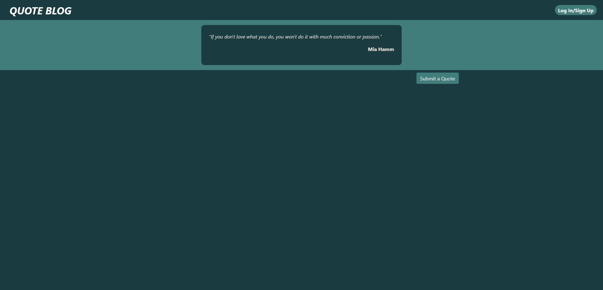
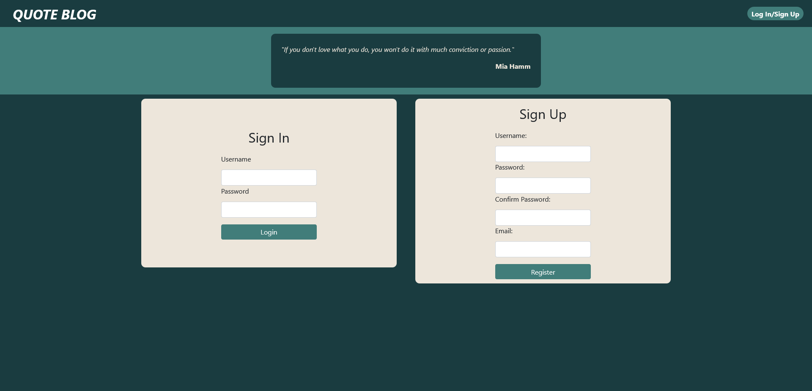

# Objective

- Main Goal
    - Create a blog template website using MERN
- This is a simple quote blog, where users can create or quote quotes that they like and talk about.

## Running App
- npm start
- yarn start

## Technical Skills

### Languages
- JavaScript
- CSS/SASS
- HTML

### Framework/Libraries
- React-bootstrap
- React JS
- Express JS
- Mongoose

### Database
- MongoDB

## Features
- User login and Registration
- Create a post
- Comment on a post
- Cookies for Authorization

## Future goals
- Display all quotes created by a user
- Search for quotes

